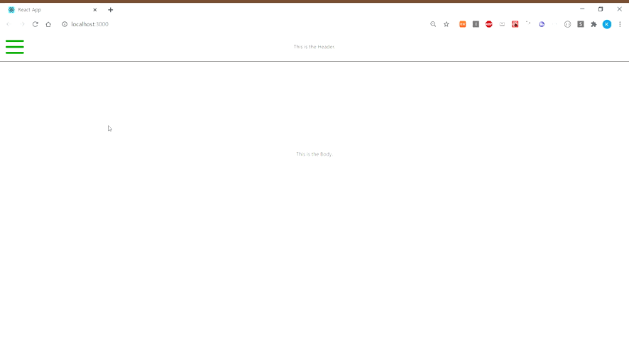

# react-animation-menu
This is a Menu Icon Component. The Icon is transformed and the Menu List appear or disappear with animation effect when it is clicked.



## Install
```
npm i react-animation-menu
```
```
yarn add react-animation-menu
```

## Usage
```jsx
import React, { useState, useCallback } from 'react'
import Menu, { MenuList } from 'react-animation-menu'
import { Group, Item } = MenuList

const elements = (
  <Group>
    <Item onClick={() => console.log('Hello')}>Hello</Item>
    <Item>Menu2</Item>
    <Item>Menu3</Item>
  </Group>
)

export default function App() {
  const [open, setOpen] = useState(false);

  const handleClick = useCallback(() => {
    setOpen(!open);
  }, [open]);

  return (
    <Menu
      color="green"
      elements={elements}
      duration={400}
      width={70}
      xOffset={40}
      onClick={handleClick}
    />
  )
}
```

## Props

- color (string | default "black")

- duration (Number | default 500)
: The value of 500 is transformed to 0.5s by being divided by 1000

- width (Number | default 50)
: This will affect the Menu Icon Wrapper size.

- height (Number | default 6)

- elements (children | default null)

- xOffset (Number | default 15)
: This prop affects x-offset of the text list wrapper on the menu.

- yOffset (Number | default 15)
: This prop affects y-offset of the text list wrapper on the menu.

- onClick (function | default undefined)

- right (default null)
: If you use this props, the burger icon and the element component will appear from the right side.

## MenuList
```
import { MenuList } from 'react-animation-menu'
```

### Group : Component
```jsx
import { MenuList } from 'react-animation-menu'
const { Group } = MenuList

<Group style={{ marginRight: '20px' }}>
  <p>Menu1</p>
  <p>Menu2</p>
</Group>
```
- style - If you use 'style' props on this Component, the build-in style does not apply.

### Item : Component
```jsx
import { MenuList } from 'react-animation-menu'
const { Group, Item } = MenuList

const handleClick = () => console.log('Hello')

<Group>
  <Item
    onClick={handleClick}
  >
    Menu1
  </Item>
  <Item
    style={{ marginLeft: '20px' }}
  >
    Menu2
  </Item>
</Group>
```
- style - If you use 'style' props on this Component, the build-in style does not apply.
- onClick - The function is fired by clicking this Component.
